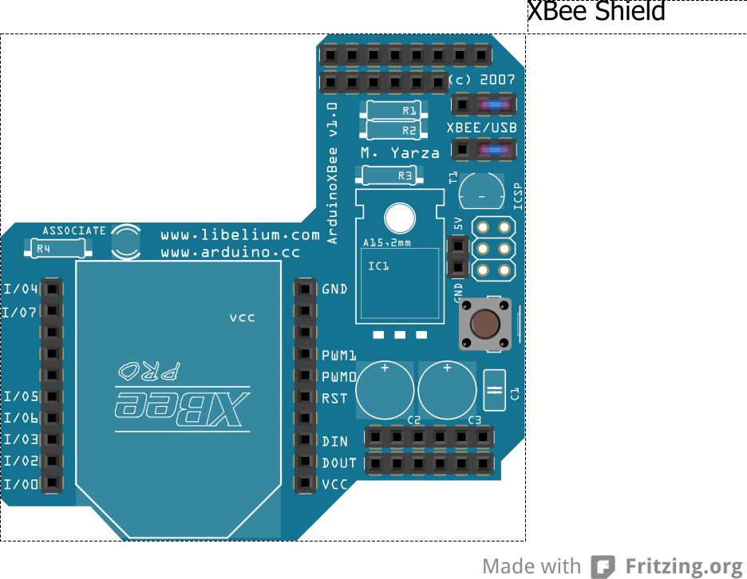

Première Application Xbee
=======

Dans cette première application nous allons envoyer périodiquement une chaine de caractères depuis un module Xbee afin de le recevoir sur le deuxième module Xbee et de l'afficher sur le terminal.

Matériel :
- 2 cartes Arduino UNO
- 2 XBee Shield
- 2 modules XBee 
- logiciel X-CTU 
- logiciel arduino

### Première Etape - Configuration des modules XBee

Cette partie va consister à configurer les deux modules XBee afin qu'ils puissent par la suite communiquer. 
Cette configuration s'effectue sous X-CTU.

1. Vérification 

  Pour réaliser cette étape il faut que les jumpers des XBee Shield soient en position USB comme ci dessous :
 
 
 
2. Test de la communication.

  Dans l'onglet `PC Settings` cliquer sur `TEST/QUERY`. Si X-CTU n'arrive pas à se connecter aux modules XBee alors il faut 
faire un pont entre la borne `RESET` et la borne `GND` de l'arduino UNO.
3. Réglage des modules XBee.

  Dans l'onglet `Modem Configuration` 

  
### Deuxième Etape - Ecriture du code et envoi du code sur l'Arduino

### Dernière Etape - Mise en Marche de l'application
